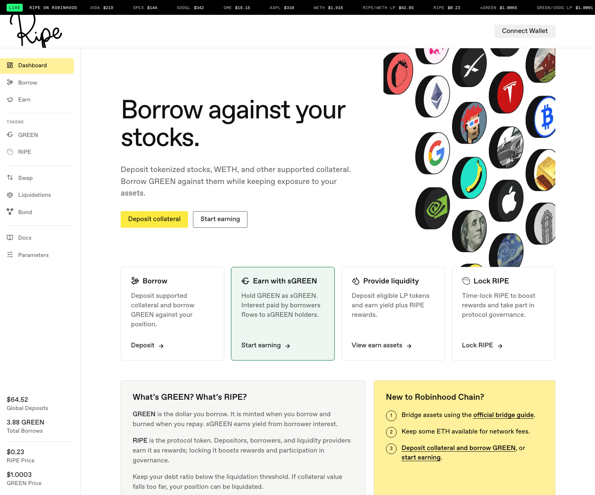

# 开始使用

以下是使用 Ripe 的简明教程。[协议文档](../README.md)介绍 Ripe 的底层工作原理；这些指南则告诉您具体该点哪里。每篇指南都可以独立阅读。

无论 Ripe 部署在哪个网络，存入、借款、还款和赚取收益的流程都一样。截图来自其中一个部署，因此您在应用中看到的具体代币名称、交易对和条款取决于所选网络。应用内的表格和 [Params](https://params.ripe.finance) 始终反映实时情况。

您需要准备三样东西：一个已连接至 Ripe 部署网络的钱包、少量该网络的 Gas 代币（当前部署使用 ETH），以及可存入的资产——最好是股票代币。

**第 1 步。** 按照该网络的官方文档将网络添加到钱包。绝不要使用搜索结果或私信中提供的网络配置。

**第 2 步。** 使用该网络的官方跨链桥转入少量 Gas。记得留出一些余额——每次存入、借款和领取都是一笔链上交易。

**第 3 步。** 获取您想存入的股票代币。请遵守两条规则：

* **核对合约地址。** 将地址与发行方的官方代币注册表进行核对（例如，Robinhood 在 [docs.robinhood.com/chain/contracts](https://docs.robinhood.com/chain/contracts/) 公布其股票代币注册表），并确认同一代币出现在 Ripe 应用的 Borrow 表格中。名称和符号相同的仿冒代币确实存在。如果地址来自其他地方，请勿使用。
* **查看发行方条款。** Ripe 不是发行方；发行方自行规定谁可以持有其代币。[Ripe 上的股票代币](../core-protocol/00-stock-tokens.md)说明股票代币在 Ripe 内如何运作，以及应去哪里阅读发行方的产品条款。

如果钱包里已经有股票代币，您就可以开始了。别忘了仍然需要 Gas。

下一步：[存入股票代币](02-deposit-collateral.md)。
