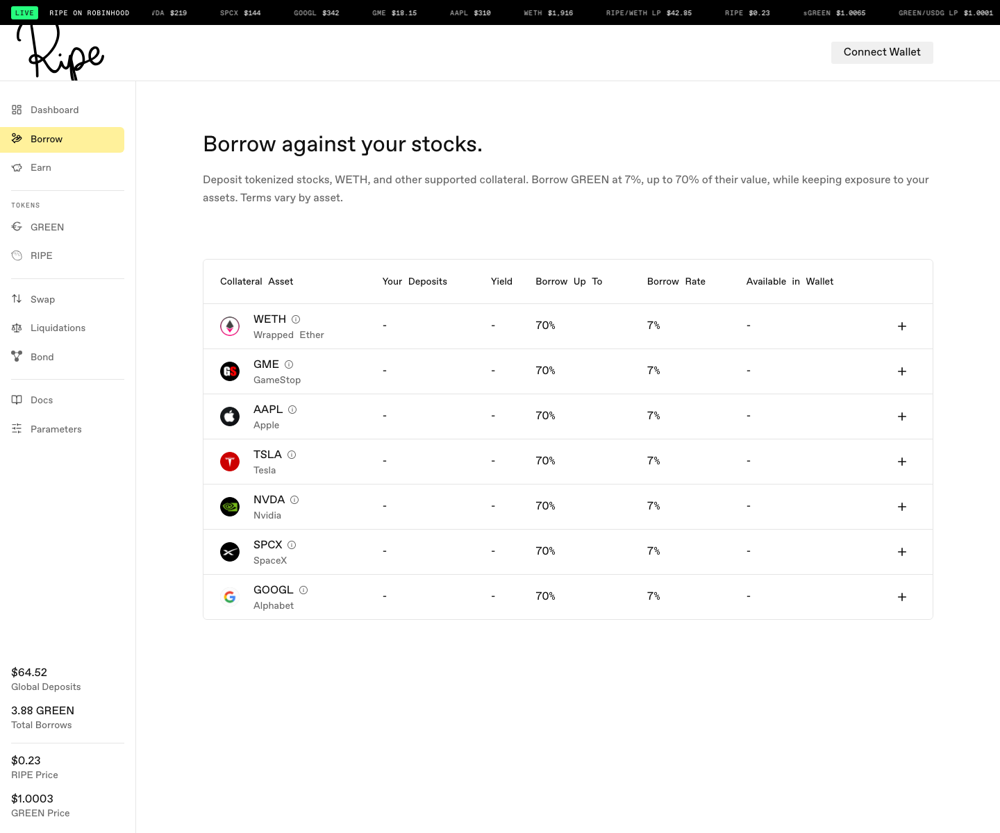
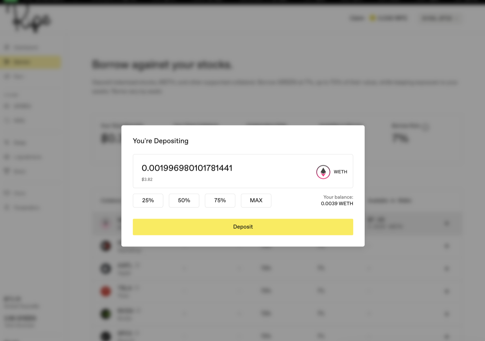
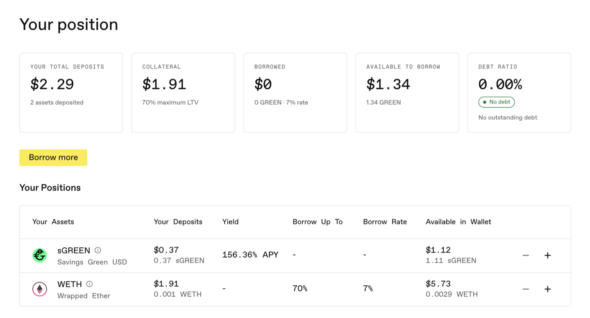

# 存入股票代币

您在 Borrow 页面存入的任何资产都会成为一笔贷款的[抵押品](../core-protocol/03-collateral-assets.md)。股票代币、WETH 以及所在网络支持的其他资产都会进入同一个仓位。

**第 1 步。** 前往 [app.ripe.finance](https://app.ripe.finance)，选择网络，然后点击右上角的 **Connect Wallet**（连接钱包）。

**第 2 步。** 从左侧菜单打开 **Borrow** 页面。表格会列出该网络上所有可存入资产及其各自条款。

**第 3 步。** 找到您持有的资产，点击该行的 **+**。钱包余额会显示在 **Available in Wallet**（钱包可用余额）一栏。

**第 4 步。** 输入金额。首次存入某种代币时，钱包会要求您执行 **Approve**（授权）——即允许协议使用本次存入的金额。先授权，再确认存入。以后存入更大金额时，可能需要再次授权。

**第 5 步。** 完成。存入金额会显示在 **Your Deposits**（您的存款）一栏，页面顶部面板中的汇总数据也会更新。

您会注意到：**Your Total Deposits**（存入资产总额）和 **Your Total Collateral**（抵押品总额）可能不同。只有具备借款能力（LTV 不为零）的资产才会提高可借额度。sGREEN、LP 代币和 RIPE 等 Earn 侧仓位不会提高额度。不过，您在稳定池中的 sGREEN 和 GREEN LP 并非与贷款完全隔离：如果仓位需要降低风险，[去杠杆](../core-protocol/05-deleverage.md)会优先使用它们。锁定的 RIPE 不会被动用。哪些资产计入借款能力，以 Borrow 表格的实时显示为准。

您可以存入任意数量的受支持资产。每种具备借款能力的资产都会共同支持[同一笔贷款](../core-protocol/02-borrowing.md)；股票代币存放期间仍保留全部上涨空间——详见 [Ripe 上的股票代币](../core-protocol/00-stock-tokens.md)。

下一步：[借入 GREEN](03-borrow-green.md)。
