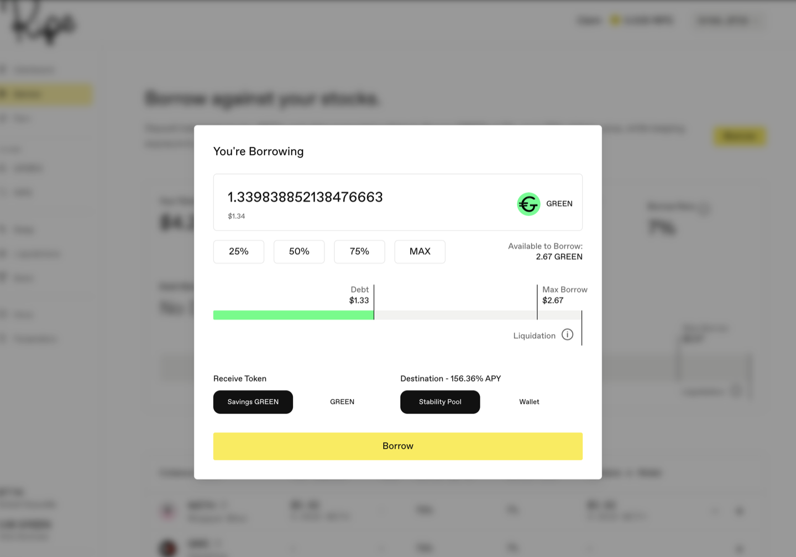
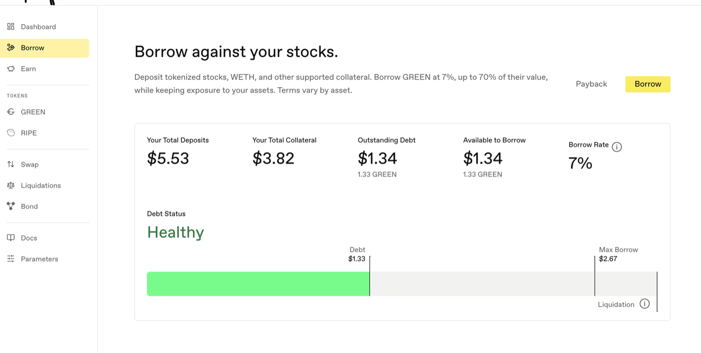
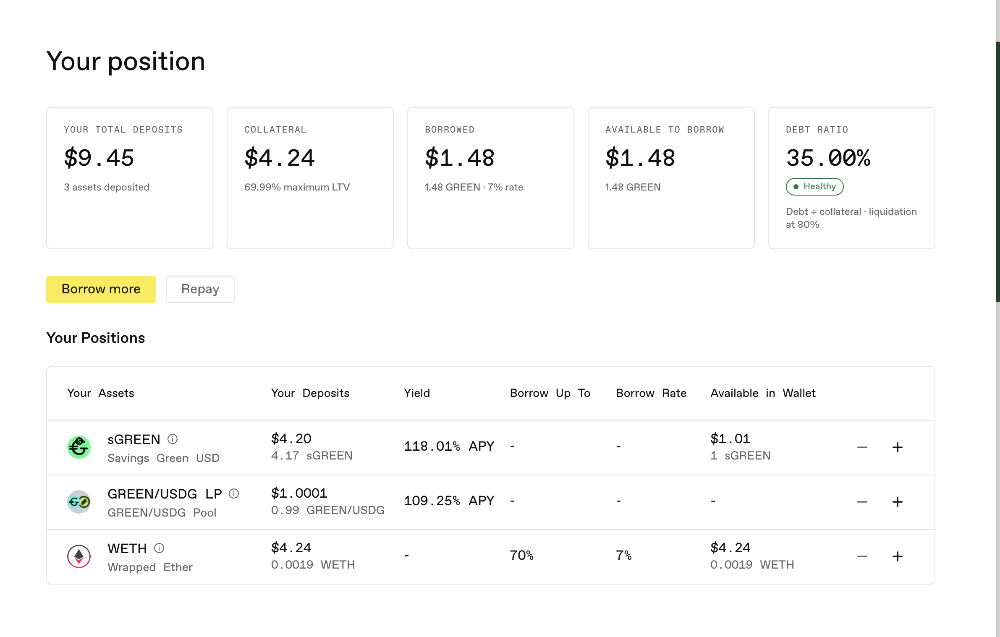

# 借入 GREEN

[GREEN](../core-protocol/01-green-stablecoin.md) 是您以存入资产作抵押借入的美元稳定币。应用会在表格中显示每种资产的利率和借款上限，并在您确认前显示自己的具体数据。

**第 1 步。** 存入抵押品后，留在 **Borrow** 页面。顶部面板会显示您的仓位：Your Total Deposits（存入资产总额）、Your Total Collateral（抵押品总额）、Outstanding Debt（未偿债务）、Available to Borrow（可借额度）和 Borrow Rate（借款利率）。

**第 2 步。** 点击该面板右上角的 **Borrow**。

**第 3 步。** 输入金额。借款时请与上限保持充足距离。价格会波动，留出余量能在价格变化时让仓位更健康。输入时，进度条会显示您的债务相对于 Max Borrow（最大借款）和 Liquidation（清算）标记的位置。

**第 4 步。** 选择接收什么以及发送到哪里。这个选项很容易忽略，但非常重要：

* **Receive Token（接收代币）：** **GREEN**（普通稳定币），或 **Savings GREEN**（[sGREEN](../earning-and-rewards/01-sgreen.md)，其 GREEN 价值会随协议收入增长）。
* **Destination（到账位置）：** **Wallet**（钱包），或 **Stability Pool**（稳定池），让资金直接开始[赚取收益](../earning-and-rewards/02-stability-pools.md)。稳定池选项仅适用于 Savings GREEN：借款会将 GREEN 包装成 sGREEN 并一步存入稳定池。普通 GREEN 始终进入您的钱包。

如果借款是为了消费，请选择 GREEN 和 Wallet。如果借款是为了赚取收益，选择 Savings GREEN 并发送至 Stability Pool，可以省去一次单独存入。

**第 5 步。** 点击 **Borrow**，并在钱包中确认。

**之后要关注什么：** Borrow 页面上的 Debt Status（债务状态），以及 Dashboard 上的 Debt Ratio（债务比率）。借款前显示 **No Debt**（无债务）；留有充足余量时显示 **Healthy**（健康），并标示债务相对于 Max Borrow 和 Liquidation 的位置。如果抵押品价值下跌过多，您的仓位可能被[清算](../core-protocol/04-liquidations.md)。

Dashboard 会在 **Debt Ratio** 卡片中显示同一仓位，并说明该比率如何计算，以及达到什么比率会触发清算。信息相同，只是用词不同。

**股票抵押品在周末的表现不同。** 股票价格源遵循市场交易时段。收市后，只要仍在该价格源的新鲜度窗口内，Ripe 就会沿用最后一个价格；如果窗口先到期，代币会在重新开市前失去价格，账户进入只能还款的等待状态。沿用周五价格并不代表休市期间安全。此时仍可能通过两种方式触发清算：价格源停止时仓位已经达到清算点，或其他仍在变动的抵押品（例如 WETH）继续下跌，单独把整体仓位推入清算区。

重新开市时，股票价格会一次性更新，而不是逐步变化。如果股票在休市期间下跌，您的仓位会一次承受全部跌幅。借款时应留出足够空间，不要让周末跳空决定仓位命运。[Ripe 上的股票代币](../core-protocol/00-stock-tokens.md#jiao-yi-shi-duan-yu-zhou-mo-tiao-kong)完整介绍了这一过程，包括价格完全缺失时会发生什么。

下一步：[偿还贷款并提取资产](04-pay-back-and-withdraw.md)。
