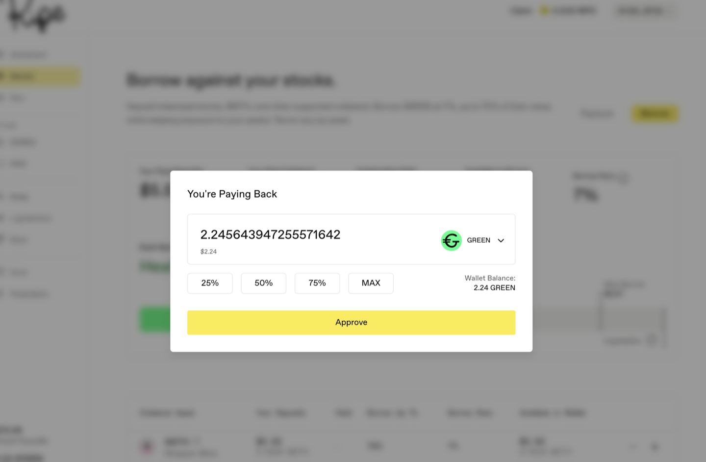
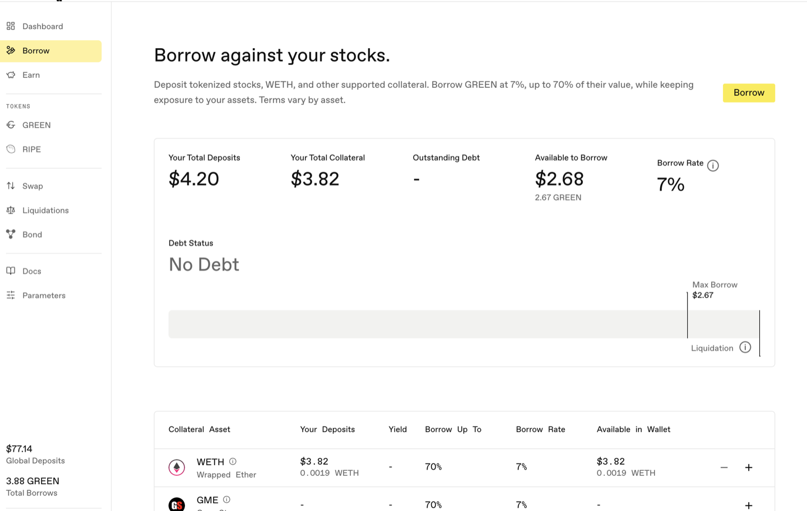

# 偿还贷款并提取资产

**第 1 步。** 前往 **Borrow** 页面，点击 Borrow 按钮旁的 **Payback**（还款）。只有存在未偿债务时才会显示该按钮；没有债务时，面板只显示 No Debt。Dashboard 中也有同一操作，但名称是 **Repay**。二者作用相同。

**第 2 步。** 选择资金来源和金额。共有两种来源，其工作方式不同：

* **从钱包支付：** 可使用 GREEN 或 [sGREEN](../earning-and-rewards/01-sgreen.md)。sGREEN 会先转换为 GREEN，再用于偿债。首次使用时按钮显示 **Approve**——这是代币授权；完成授权后，按钮会变为 Payback。MAX 按钮会清偿全部债务，并将多余部分以 sGREEN 退还。
* **从稳定池存款支付：** 切换 **Source**（来源）开关，直接使用已存入 Earn 的 sGREEN 或 LP 代币还款。该操作执行的是[去杠杆](../core-protocol/05-deleverage.md)，而不是普通还款：协议使用您的池中仓位偿还债务，无需授权。这种方式无需动用钱包即可减债，而且绝不会动用您的股票代币。

付款到账后，您的债务比率会立即改善。

**第 3 步。** 如需提取抵押品，请点击抵押资产表格中该资产一行的 **-**（**+** 用于存入，**-** 用于提取）。您可以提取无需用于覆盖剩余债务的部分，但协议会保留一小段缓冲：Ripe 会让债务保持在借款上限之下，因此不能一直提取到临界点。已还清全部债务？那么您可以提取全部资产。仓位处于清算状态时无法提取；请先还款或增加抵押品以退出清算状态。

**第 4 步。** 在钱包中确认，然后查看钱包余额。

下一步：[获取 GREEN 并提供流动性](05-provide-liquidity.md)。
