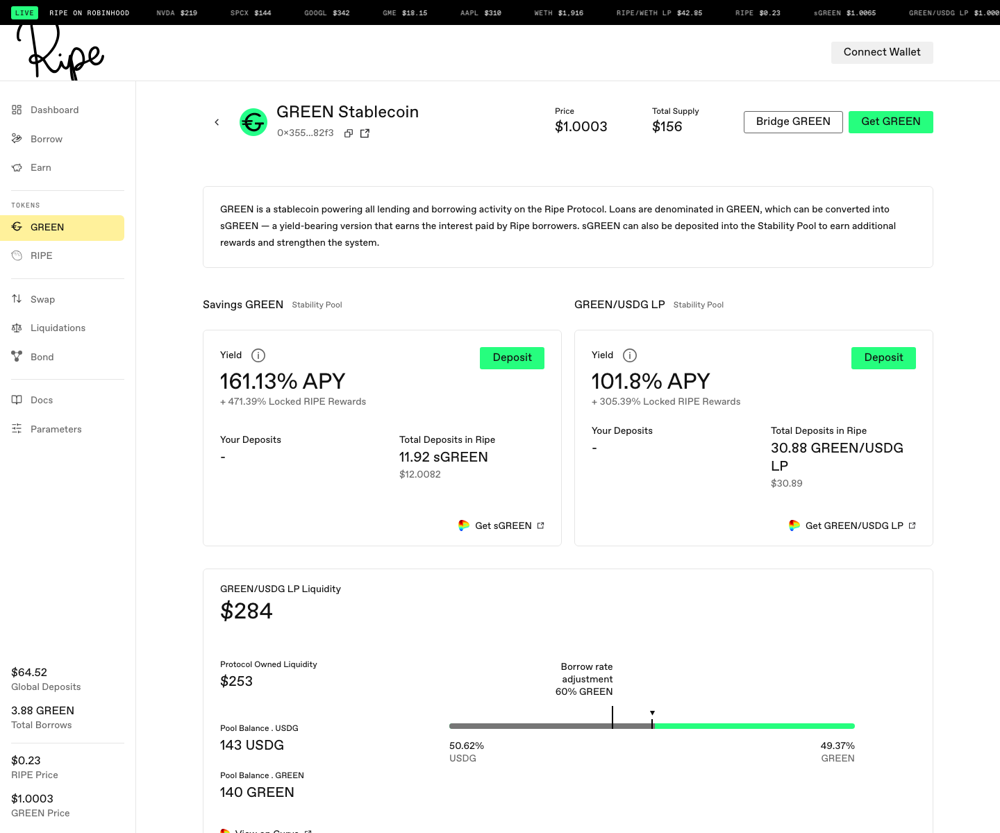
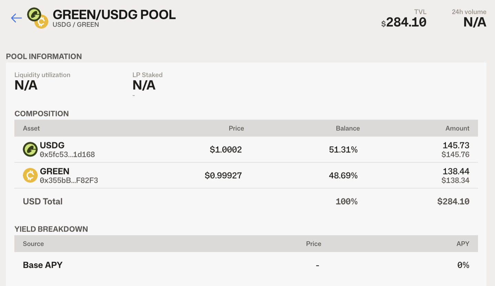
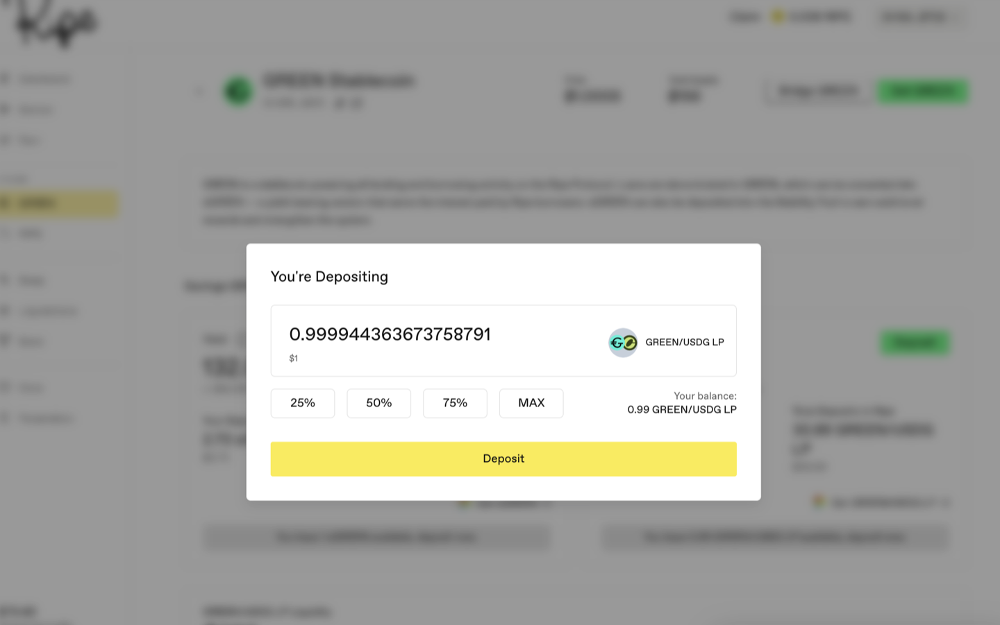
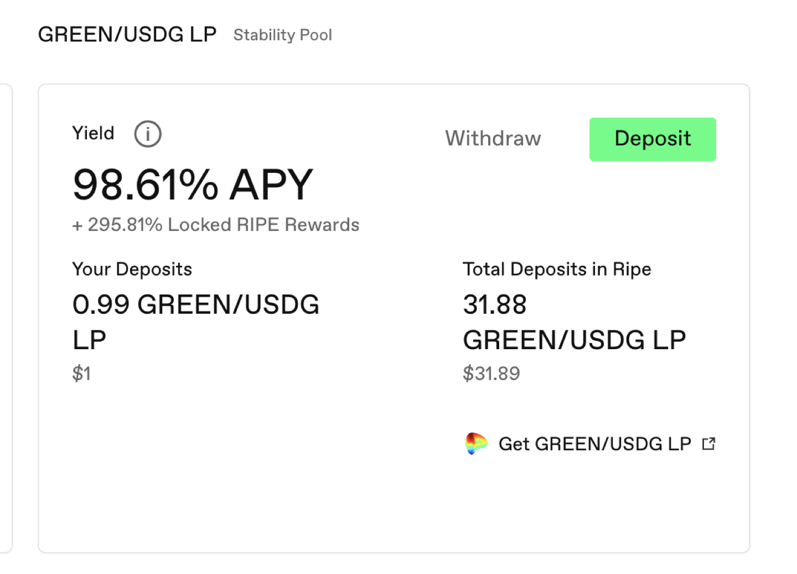
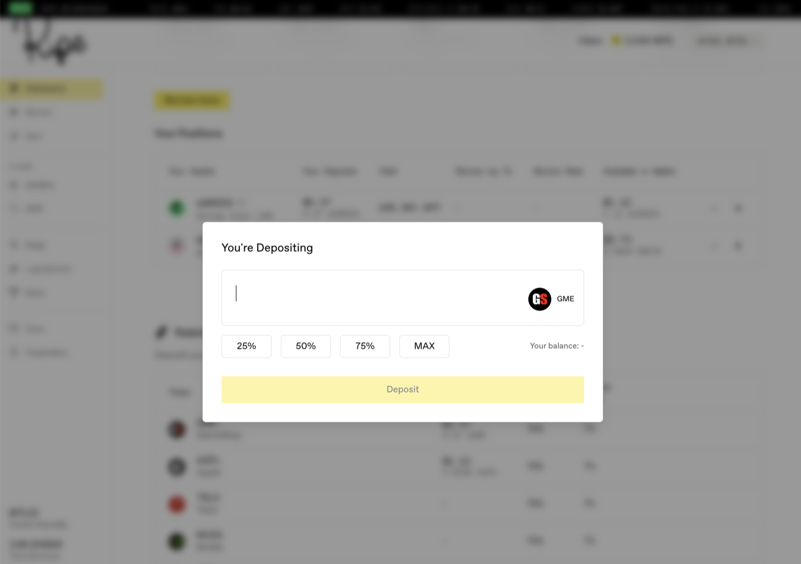
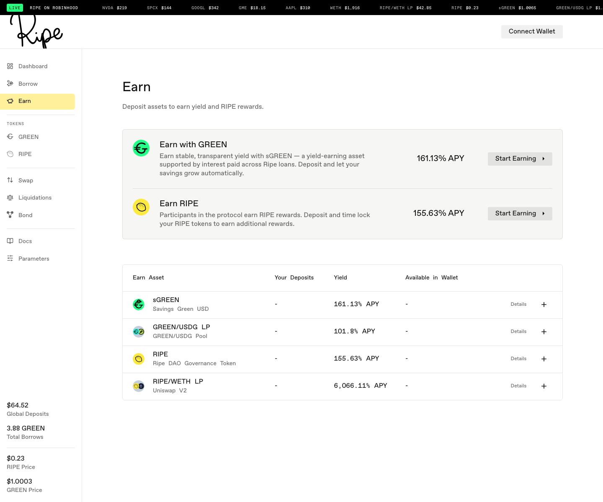

# 获取 GREEN 并提供流动性

GREEN 稳定币池的流动性提供者会将 LP 代币存入[稳定池](../earning-and-rewards/02-stability-pools.md)，并赚取 [RIPE 奖励](../earning-and-rewards/03-ripe-rewards.md)。具体交易对取决于所在网络；截图展示的是 Curve 上的 GREEN/USDG，所以下文以它为例。

**第 1 步。** 获取 GREEN。方法有两种：[借入 GREEN](03-borrow-green.md)，或在 GREEN 页面点击 **Get GREEN** 并兑换获得。

**第 2 步。** 获取交易对的另一侧——本例中为 USDG。您可以在 DEX 上兑换获得，或通过跨链桥转入。

**第 3 步。** 将持有的资产变成 LP 代币。共有两条路径：

* 快速路径：点击 **Get GREEN**，并将兑换的 To（目标）资产设为 LP 代币（本例为 **GREEN/USDG LP**）。一次兑换即可从稳定币直接得到 LP 代币，资金池两侧的资产都会自动为您处理。
* 手动路径：点击 **Get GREEN/USDG LP**。这会把您带到 Ripe 应用外的 Curve 资金池。请自行在 Curve 上添加两侧资产；只用单边资产也能进入，但会产生滑点，因此最好同时准备两边。

无论哪种方式，最终您的钱包都会收到代表资金池份额的 LP 代币。

**第 4 步。** 这是最容易遗漏的一步：返回 Ripe，进入 **Earn** 页面，找到标有 Stability Pool 的 LP 代币行，然后点击 **Deposit**。留在钱包里的 LP 代币不会从 Ripe 获得任何收益；只有存入的 LP 代币才会赚取 RIPE 并参与清算。

存入后，卡片会显示您的仓位、收益率及额外的 RIPE 奖励。当清算通过该池执行时，池中的部分 LP 流动性会换成被清算的抵押品——它会显示为可领取抵押品，而不再是 LP 代币。

还有一个值得记住的捷径：如果本来就要借款，借款对话框可以把 Savings GREEN 直接发送到稳定池，省去先进入钱包再存入的过程。

如果存入框显示“Your balance: -”，表示您还没有这种代币。请返回并先完成第 3 步。

**第 5 步。** 奖励会自动累积并显示在 Dashboard（仪表板）上。奖励以 RIPE 支付，因此领取时会打开[下一篇指南介绍的领取对话框](06-get-and-lock-ripe.md#ling-qu-jiang-li-shi-ru-he-ying-yong-suo-ding)，其中会把您领取的一部分 RIPE 质押并锁定。首次领取前，请先阅读该部分。

关于页面上显示的收益率：这些都是估算值。新资金池因为存款规模仍小，往往会显示很高的收益率；随着资金池增长，收益率会下降。

下一步：[获取并锁定 RIPE](06-get-and-lock-ripe.md)。
