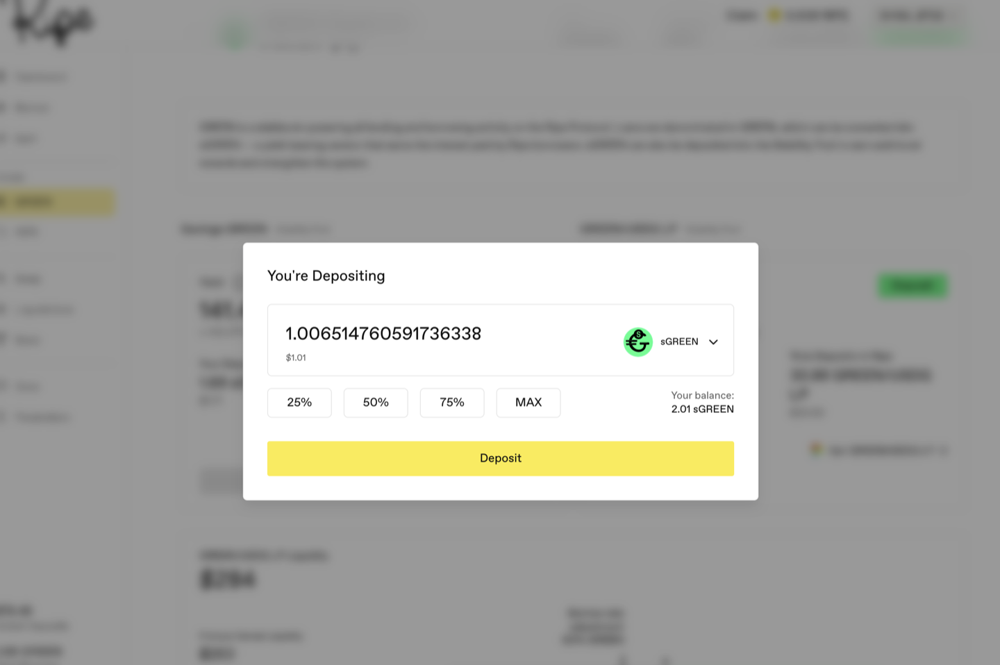
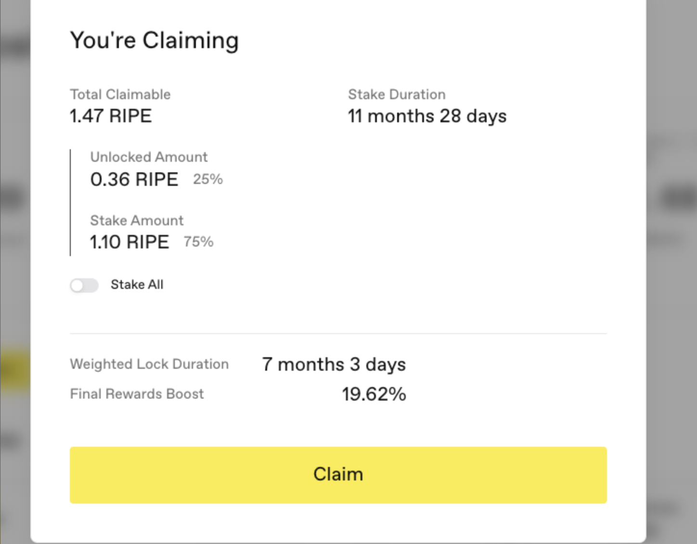

# 获取并锁定 RIPE

RIPE 是协议代币。锁定 RIPE 可以提高奖励，并累积治理积分；链上[治理](../governance-and-economics/02-governance.md)上线后，这些积分将成为您的投票权重。

**第 1 步。** 获取 RIPE：在 RIPE 页面点击 **Get RIPE** 兑换获得；如果您在其他网络持有 RIPE，则点击 **Bridge RIPE**。另外两种获取方式是 [Ripe 债券](../governance-and-economics/03-bonds.md)（支付稳定币，按当前纪元价格获得 RIPE，并可选择锁定以取得加成）和 [RIPE Reserve Engine](../governance-and-economics/04-reserve-engine.md)（预先付款，获得一笔更大的 RIPE 配额并随时间归属）。两者是否可用取决于所在网络启用了哪些功能。

先说明 RIPE 奖励来自哪里，让您知道自己在参与什么：协议每个区块分发 RIPE，在质押者（RIPE、RIPE LP 和稳定池存款人）与借款人之间分配。RIPE 页面会显示实时分配比例和每日数量。[RIPE 奖励指南](../earning-and-rewards/03-ripe-rewards.md)解释奖励的计算方式。

**让 RIPE 发挥作用有两种方式**，它们并排显示在 RIPE 页面上。第一种是按下文步骤直接存入 RIPE。第二种是将 RIPE 与所在网络的 ETH 配对，获得 RIPE LP 代币后再存入；请使用 **Get RIPE/WETH LP** 链接（截图中使用 Uniswap V2）。LP 路径存在常见的流动性提供者权衡：收益更高，但随着两种代币价格变化，仓位会在二者之间移动，因此退出时持有的 RIPE 数量可能与存入时不同。两种路径都以 RIPE 支付奖励，所以下文的领取规则均适用。

**第 2 步。** 前往 **RIPE** 页面（或 **Earn** 页面），找到 RIPE 一行并点击 **Deposit**。

**第 3 步。** 使用 25% / 50% / 75% / MAX 按钮或直接输入金额。

**第 4 步。** 选择锁定期限。存入时是唯一由您自行设置锁定期限的场景；领取奖励附带的锁定期限由协议设置。之后可以延长锁定，但不能直接缩短。

选择前要理解：您的 RIPE 仓位只有一个**加权后的统一锁定期限**，而不是每笔存款分别锁定。每次新存款都会根据金额和期限加权计入该数值。以较短期限存入一大笔 RIPE，会缩短整个仓位的加权期限；以较长期限存入，则会延长。期限越长，奖励加成越高，而且加成适用于全部持仓，而不只是新增部分。

[治理指南](../governance-and-economics/02-governance.md)还详细解释了另一点：每当仓位被触碰——存入、领取或延长锁定——都会结算当时的锁定加成。在锁定仍很长时触碰仓位，您就能获得这段加成；如果一直不动，直到锁定到期后才再次触碰，整个这段期间都不会获得加成。

**第 5 步。** 点击 **Deposit** 并在钱包中确认。您的仓位和奖励会显示在页面上。

## 领取奖励时如何应用锁定

这是 Ripe 最容易让人意外的部分，因此请在领取任何奖励前读完。

打开领取对话框后，可领取金额会分成两部分：发送到钱包的 **Unlocked Amount**（解锁金额），以及用于质押的 **Stake Amount**（质押金额）。分配比例是协议参数（截图中为 25% 可流动 / 75% 质押），因此请以对话框中显示的两个数字为准，不要假定仍是上次看到的比例。

**Stake All**（全部质押）开关只能让更多 RIPE 进入质押。关闭时，您会收到解锁部分；打开时，全部奖励都会被质押，钱包不会收到任何 RIPE。除非协议的自动质押比例为零，否则没有任何设置能让全部金额保持流动。

接下来是许多人没有预料到的部分：

**质押奖励会对您已存入的全部 RIPE 应用锁定，而不只是新质押的奖励。** 对话框将其显示为 **Weighted Lock Duration**（加权锁定期限）：它会把现有仓位与新质押奖励合并为一个覆盖全部 RIPE 的锁定。截图中，新领取奖励采用 11 个月 28 天的锁定，合并后整个仓位的加权锁定期限变为 7 个月 3 天，并获得相应的新奖励加成。具体加成取决于所在部署的锁定条款，请以对话框为准，而不是截图。

因此，领取奖励从来不是一个中性的动作。只要一次领取包含质押，就会按照重新计算的期限再次锁定您的整个 RIPE 仓位。

**点击 Claim 前，请查看以下四个数字：**

* **Unlocked Amount：** 实际进入钱包的金额。
* **Stake Amount：** 被质押而非进入钱包的金额。
* **Weighted Lock Duration：** 确认后整个仓位承诺锁定多久。
* **Final Rewards Boost：** 您因此获得的最终奖励加成。

## 提前退出锁定需要付出代价

如果所在网络启用了提前退出，在锁定结束前离开会损失余额中的很大一部分——这是一个协议设定的固定比例，而不是随时间递减的比例（治理页面示例为 80%）。解除锁定和提取是两个独立步骤；坏账冻结可能同时阻止二者。[治理指南](../governance-and-economics/02-governance.md#ti-qian-tui-chu-zui-hou-shou-duan)完整解释了该机制。

正因为存在这项成本，存入时才必须认真选择锁定期限，并在每次领取前检查 Weighted Lock Duration。存入这里的 RIPE 应当视为已经留作长期用途的资金。如果您可能需要更早使用，坦率的选择是让 RIPE 保持未锁定状态留在钱包中，并放弃加成。

下一步：[查看可以存入 Earn 的所有资产](07-what-you-can-deposit-on-earn.md)。
